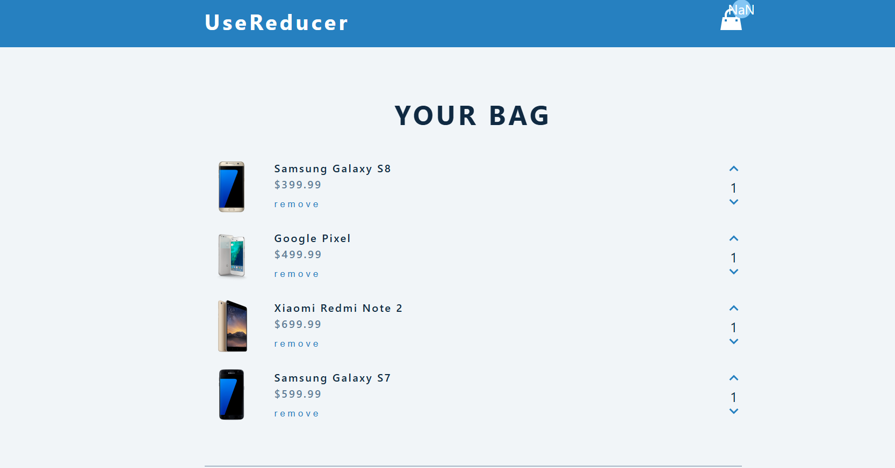

# cart

this project is sample project how to add remove and clear items 
to the cart
it uses Usecontext hook to provide data 

and use reducer to deliver different action type 

use useEffect to fetch the data

it has Navbar component

# sample page picture 

# bisrat 
# Dallas Nov 2  2024